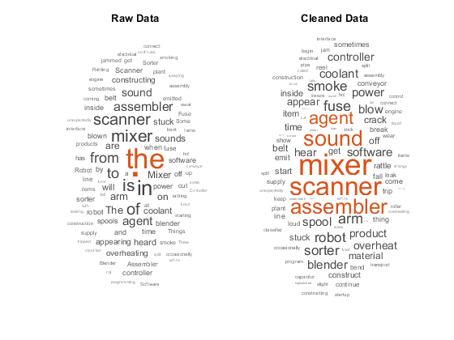
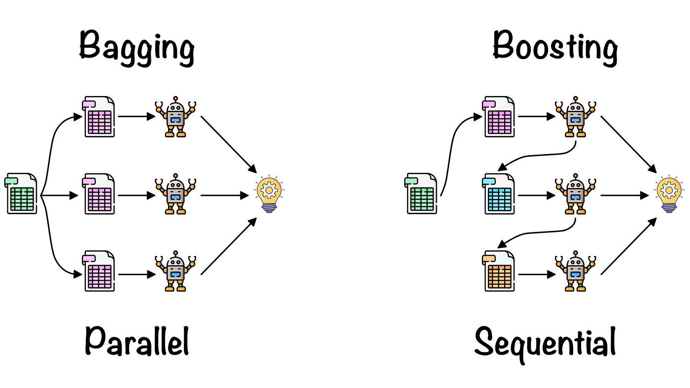
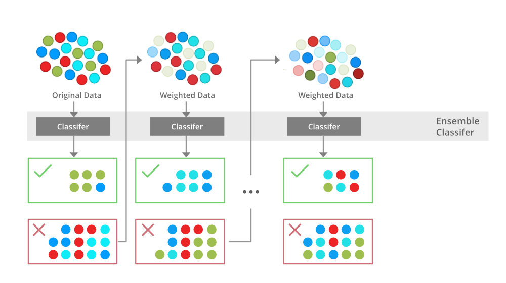

# HAZARD FORECAST TWEETS

<p align="center">
    
</p>

Welcome to the Hazard Forecast Tweets (HFT)
_____________
One of the greatest problems in nowadays society is try to avoid that environmental hazards could cause damages to people and to infrastructures. So, what mathematics can do to support this task, is the development of an approach which analyses the information collected by people, to undestand if some critical situations are going to happen. In particular, a very good operation to perform is to analyse tweets that people share through the platform X. The aim of this GitHub repo is to discriminate if every tweet represents a real threat, or if it is nothing more than a caption to nice picture shared by some user (like the one in the figure above).


## Contents
1. [Dependency](#dependency)
2. [Data](#data)
3. [Data preparation](#data-preparation)
4. [Bagging vs. Boosting](#bagging-boosting)
5. [Random Forest](#random-forest)
6. [XGBoost](#xgboost)


## Dependency
This code was tested with Python 3.
```bash
pip install numpy pandas nltk scikit-learn
nltk.download('punkt')
nltk.download('wordnet')
nltk.download('averaged_perceptron_tagger')
nltk.download('stopwords')
```
The "nltk_data" which is saved should be put at the "..//venv//Lib//" path

The "nltk_data_path" and "path_file" variables into the "main.py" function must
be changed with the path of the personal pc.


## Data
The data used can be found a the following [kaggle](https://www.kaggle.com/datasets/vstepanenko/disaster-tweets/data) reference. The form of the data is the following:

| ID | Keyword | Location | Text | Target |
| :---:            | :---:            | :---:            | :---:            | :---:            |
| 0 | ablaze | -- | "Arsonist sets cars ablaze at dealership https://t.co/gOQvyJbpVI" | 1 |
| 5 | epicentre | Spain | #Spain undiscovered #gems: #Requena is known for its many wineries. This picturesque town was originally the epicen… https://t.co/hQ0isff9ql | 0 |
| 9 | epicentre | Mooloolaba | "Cudgewa in the epicentre of the fires near Corryong, all pasture paddocks burnt , houses burnt , stock losses , cattle now be…" | 1 |

where:
- "ID" represents the identifier of the tweet;
- "Keyword" represents the most significant word of the tweet;
- "Location" represents the location the tweet was sent from;
- "Text" represents the body of the tweet;
- "Target" represents the boolean variable which indicates if the tweet talks about an incoming danger (1) or not (0);

The loaded file must be put in the folder of the repo and be named **"tweets.csv"**. In the current repo there is an example file to present the way the file must be created.


## Data preparation
<p align="center">
    
    <br>
    <sup>Data preparation</sup>
</p>

The process of data preparation consists of different steps:
(1) Loading of libraries useful for the sentences simplification;
(2) Tokenization of every tweet;
(3) Lemmatization of every word, to make it as simple as possible;
(4) All the words are lowered.

If this operation over the dataframe, which is performed calling the **data_preprocessing()** function, has already been done, the boolean variable *data_prepare* must be put to *False*.

After all these operations of data preprocessing, every tweet has been transformed to words or verbs in their simplest form, with the lower form, in order to have a text as easy as possible for the following operations.


## Bagging vs. Boosting
<p align="center">
    
    <br>
    <sup>Bagging vs. Boosting</sup>
</p>

Bagging and boosting are both ensemble learning techniques used to improve the performance of machine learning models, but they differ significantly in their approaches and objectives. Here are the principal differences between the two:

1. _Methodology_:
**Bagging (Bootstrap Aggregating)**:
Creates multiple models independently using random subsets of the training data.
Each model is trained in parallel.
Predictions are aggregated (typically by averaging or voting) to produce a final result.
**Boosting**:
Trains models sequentially, where each new model focuses on correcting the errors made by previous models.
Each model is dependent on the previous ones.
Predictions are combined through a weighted sum, giving more importance to misclassified instances.

2. _Objective_:
**Bagging**:
Primarily aims to reduce variance and prevent overfitting.
Works best with high-variance models (e.g., decision trees).
**Boosting**:
Aims to reduce bias and improve accuracy.
Works effectively with weak learners, turning them into a strong predictive model.

3. _Robustness to Outliers_:
**Bagging**:
Generally more robust against outliers since it averages predictions from multiple models.
**Boosting**:
More sensitive to outliers, as it focuses on correcting errors, which can lead to overfitting.

4. _Training Speed_:
**Bagging**:
Faster due to parallel training of models.
**Boosting**:
Slower because it requires sequential training.

5. _Examples_:
**Bagging**: Random Forest, Extra Trees.
**Boosting**: AdaBoost, Gradient Boosting, XGBoost.


## Random Forest
<p align="center">
    
    <br>
    <sup>Random Forest structure</sup>
</p>

_Random Forest_ is a powerful supervised machine learning algorithm widely used for both classification and regression tasks.

**Definition**: Random Forest is an ensemble learning method that constructs multiple decision trees during training and outputs the mode of their predictions (for classification) or the mean prediction (for regression).
Ensemble Learning: It combines the predictions from multiple models to improve accuracy and robustness, reducing the risk of overfitting compared to individual decision trees.

**Advantages**
High Accuracy: Generally produces high accuracy due to the ensemble nature of combining multiple models.
- Versatility: Can be used for both classification and regression problems.
- Scalability: Works well with large datasets and high-dimensional spaces.
- Parallelization: Trees can be built independently, allowing for efficient parallel processing.

**Disadvantages**
- Complexity: The model can become complex and less interpretable compared to a single decision tree.
- Computational Cost: Building many trees can be computationally expensive and time-consuming, especially with large datasets.


## XGBoost
<p align="center">
    
    <br>
    <sup>XGBoost structure</sup>
</p>

_XGBoost_, which stands for eXtreme Gradient Boosting, is a highly efficient and scalable implementation of the gradient boosting framework. It has gained immense popularity in the machine learning community due to its performance and versatility across various tasks.

**Gradient Boosting Framework**
XGBoost builds on the principles of gradient boosting, where weak learners (typically decision trees) are combined to create a strong predictive model. Each subsequent tree is trained to correct the errors made by its predecessors.

**Parallel Processing**
One of the standout features of XGBoost is its ability to perform parallel processing, which significantly speeds up the training process. This is achieved by parallelizing the construction of trees and optimizing the computation of gradients.

**Regularization**
XGBoost includes built-in L1 (Lasso) and L2 (Ridge) regularization techniques, which help prevent overfitting and improve model generalization.